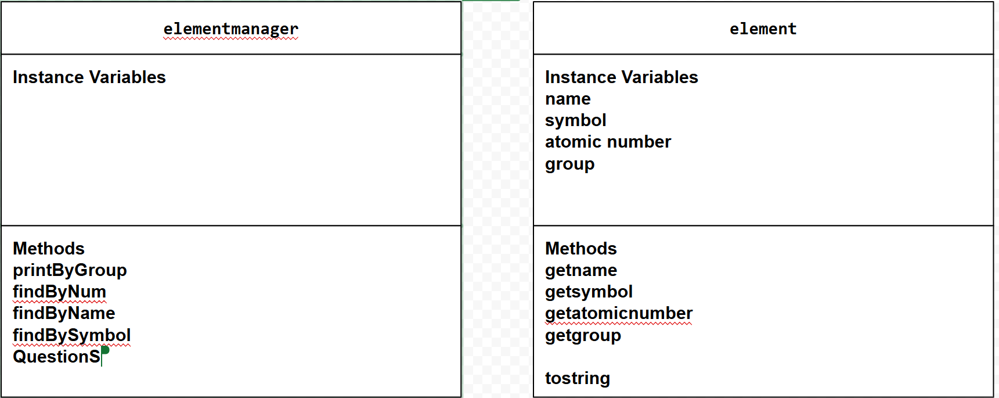

# Unit 3 - Data for Social Good Project 

## Introduction 

Software engineers develop programs to work with data and provide information to a user. Each user has different needs based on the information they are looking for from data. Your goal is to create a data analysis program for your user that stores and analyzes data to provide the information they need. 

## Requirements 

Use your knowledge of object-oriented programming, one-dimensional (1D) arrays, and algorithms to create your data analysis program: 
- **Write a class** – Write a class to represent your user or business and store and analyze their data with no-argument and parameterized constructors. 
- **Create at least two 1D arrays** – Create at least two 1D arrays to store the data that your user needs information about. 
- **Write a method** – Write a method that finds or manipulates the elements in a 1D array to provide the information your user needs. 
- **Implement a toString() method** – Write a toString() method that returns general information about the data (for example, number of values in the dataset). 
- **Document your code** – Use comments to explain the purpose of the methods and code segments and note any preconditions and postconditions. 

## User Story 

Include your User Story you analyzed for your project here. Your User Story should have the following format: 

> As Chemistry Student,   
> I want to study the periodic table elements,   
> so that I can pass Ms. Tashjians AP Chem exam. 

## Dataset 

Include a hyperlink to the source of your dataset used for this project. Additionally, provide a short description of each column used from the dataset, and the data type. 

Example: 

Dataset: https://docs.google.com/spreadsheets/d/1kHqfRxn5TaJKUvykvPVXt2vdw9gOrKIpG5VcshYyTLc/edit?usp=sharing
- **Name** (String) - Name of the element
- **Symbol** (String) - Atomic Symbol of the element
- **Atomic Number** (int) - Atomic Number of the element
- **Group** (String) - The Group of the element on the periodic table

## UML Diagram 

Put and image of your UML Diagram here. Upload the image of your UML Diagram to your repository, then use the Markdown syntax to insert your image here. Make sure your image file name is one work, otherwise it might not properly get display on this README. 

 

## Description 

Write a description of your project here. In your description, include as many vocab words from our class to explain your User Story, the chosen dataset and how your project addressed that users goals. If your project used the Scanner class for user input, explain how the user will interact with your project.

In this project, the code will analyze, sort, and traverse many 1D arrays that have been instantiated using the file reader class and cleaned data that has been divided into multiple text files. We decided to choose the dataset for the periodic table of elements, after choosing the dataset we cleaned some of the data and decided on which collumns we wanted to use. Using the scanner class, the user can interact with the program so that they can tell the program what parameters they want to filter by. The user will be able to filter the elements by every collumn we used: Name, Symbol, Atomic Number, and Group. They will also be bale to print out the groups of all the elements to make sure they write the correct group (Program is case and space sensitive) and print out all the elements just for fun.